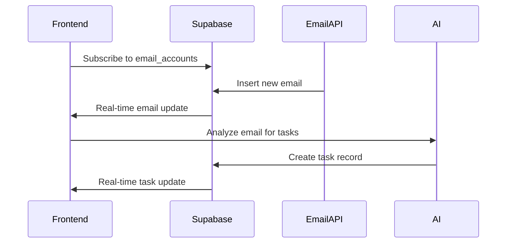
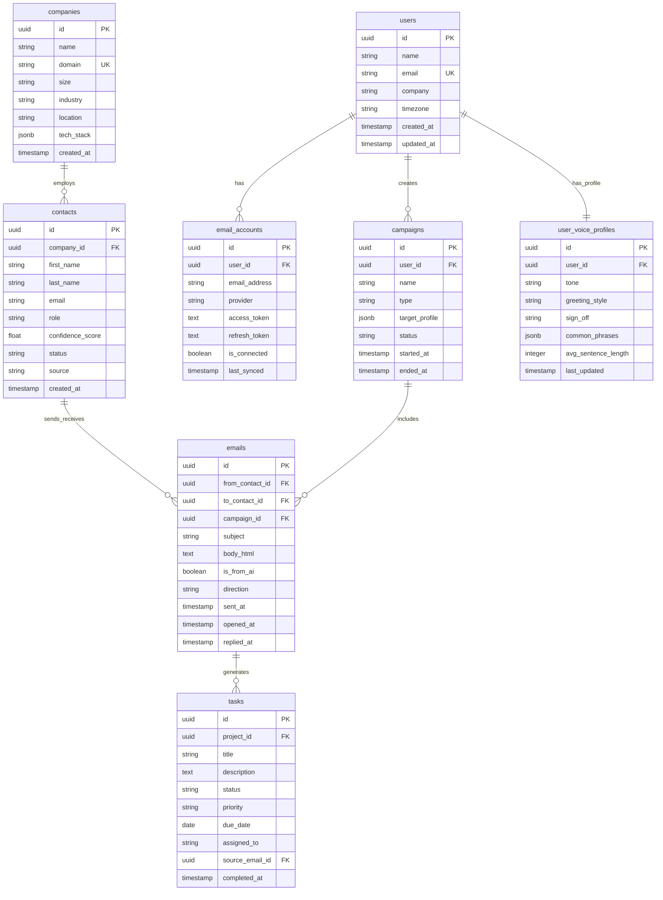
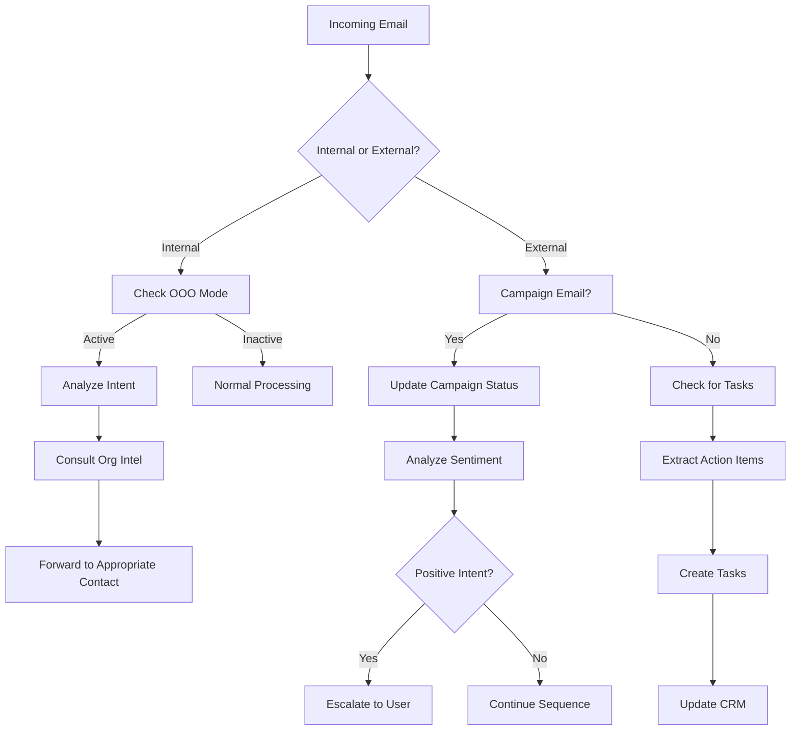
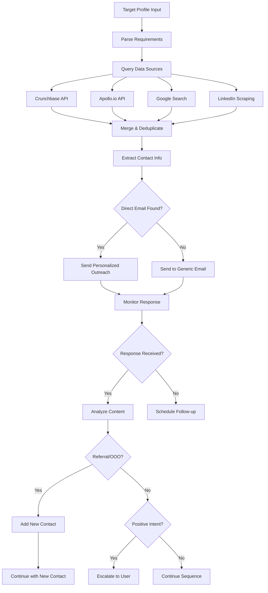
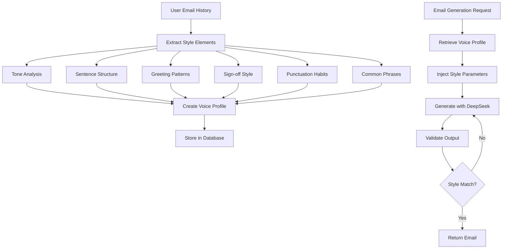
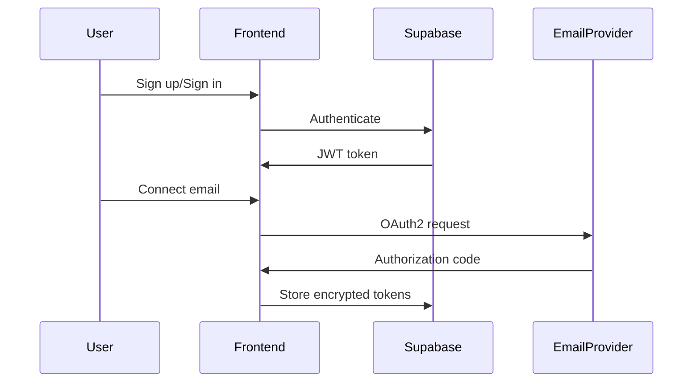

# Lima AI Growth Operating System - Design Document

## Overview

Lima is an AI-powered growth operating system designed for B2B professionals who need to scale their outreach and relationship management without scaling headcount. The platform functions as an autonomous relationship engine that combines intelligent email outreach, self-updating CRM capabilities, AI-driven project management, and predictive analytics into a single unified workspace.

### Core Value Proposition
- **Autonomous Email Management**: Lima operates as a tireless digital extension capable of sending hyper-personalized emails, navigating organizational structures, and maintaining accurate contact databases
- **Dual Identity Modes**: Users can operate in "You Mode" (emails sent under user identity) or "Agent Mode" (Lima acts as AI teammate with separate identity)
- **Self-Learning System**: Lima learns user writing style, builds organizational intelligence maps, and continuously improves through email interactions
- **Zero Manual CRM**: Database evolves in real-time based on email interactions without manual input

### Target Users
- B2B sales professionals
- Business development teams
- Growth marketers
- Startup founders
- Account managers scaling outreach efforts

## Technology Stack & Dependencies

### Frontend Architecture
- **Framework**: React 18+ with Next.js App Router
- **Styling**: Tailwind CSS with custom design tokens
- **UI Components**: Headless UI and Radix UI for accessible, customizable components
- **State Management**: React Context with useReducer for global state, Zustand for complex local state
- **Real-time Updates**: Supabase Realtime for live synchronization
- **Hosting**: Vercel with edge deployment capabilities

### Backend Architecture
- **Runtime**: Node.js 20+ with Express and Next.js API Routes
- **Serverless Functions**: Vercel Serverless Functions for API requests
- **Background Workers**: Fly.io or Railway for long-running processes
- **Database**: Supabase (PostgreSQL) with real-time capabilities
- **Authentication**: Supabase Auth with OAuth2 support

### AI & ML Services
- **Primary AI**: DeepSeek API (DeepSeek-V3 or DeepSeek-R1)
- **Capabilities**: 128K context length, cost-effective pricing, fine-tuning support
- **Use Cases**: Email generation, task extraction, insights, voice matching

### Email Infrastructure
- **Agent Mode**: Resend (built on Amazon SES)
- **You Mode**: Gmail API and Microsoft Graph API
- **IMAP Fallback**: Custom implementation with imap-simple and nodemailer
- **Deliverability**: Built-in inbox warming system

### Third-Party Integrations
- **Contact Discovery**: Hunter.io, Apollo.io, Clearbit
- **Company Data**: Crunchbase API, LinkedIn, Google Search
- **Calendar**: Google Calendar API with OAuth2
- **DNS/Domains**: Cloudflare or AWS Route 53

## Frontend Architecture

### Component Hierarchy

```mermaid
graph TD
    A[App Layout] --> B[Dashboard]
    A --> C[Email Interface]
    A --> D[CRM]
    A --> E[Campaigns]
    A --> F[Projects]
    A --> G[Settings]
    
    B --> B1[Growth Pulse]
    B --> B2[Campaign Performance]
    B --> B3[AI Activity Log]
    B --> B4[Predictive Insights]
    
    C --> C1[Inbox View]
    C --> C2[Compose Modal]
    C --> C3[Thread View]
    C --> C4[AI Assistant Panel]
    
    D --> D1[Companies List]
    D --> D2[Contacts View]
    D --> D3[Relationship Map]
    D --> D4[Contact Details]
    
    E --> E1[Campaign Builder]
    E --> E2[Target Definition]
    E --> E3[Template Editor]
    E --> E4[Performance Analytics]
    
    F --> F1[Project Board]
    F --> F2[Task Cards]
    F --> F3[AI Task Queue]
    F --> F4[Timeline View]
```



### State Management Architecture

#### Global State (React Context)
- User authentication and profile
- Email accounts and connection status
- Real-time notifications
- Theme and UI preferences

#### Local State (Zustand)
- Email interface state (selected emails, filters, compose mode)
- CRM data and filtering
- Campaign builder state
- Dashboard analytics and time ranges

### Real-time Data Flow



## Backend Architecture

### API Endpoints Reference

#### Authentication Endpoints
- `POST /api/auth/signup` - User registration
- `POST /api/auth/signin` - User login
- `POST /api/auth/signout` - User logout
- `GET /api/auth/session` - Get current session

#### Email Integration Endpoints
- `POST /api/email/connect` - Connect email account (OAuth2)
- `GET /api/email/accounts` - List connected accounts
- `POST /api/email/sync` - Manual sync trigger
- `DELETE /api/email/disconnect` - Disconnect account

#### Email Management Endpoints
- `GET /api/emails` - Fetch emails with pagination
- `POST /api/emails/send` - Send email (You Mode or Agent Mode)
- `PUT /api/emails/{id}/reply` - Reply to email
- `POST /api/emails/analyze` - AI analysis for tasks/insights

#### CRM Endpoints
- `GET /api/companies` - List companies with filters
- `POST /api/companies` - Create company
- `GET /api/contacts` - List contacts with filters
- `POST /api/contacts` - Create contact
- `PUT /api/contacts/{id}` - Update contact

#### Campaign Endpoints
- `GET /api/campaigns` - List campaigns
- `POST /api/campaigns` - Create campaign
- `POST /api/campaigns/{id}/start` - Start campaign
- `GET /api/campaigns/{id}/analytics` - Campaign performance

#### AI Service Endpoints
- `POST /api/ai/generate-email` - Generate AI email
- `POST /api/ai/extract-tasks` - Extract tasks from email
- `POST /api/ai/analyze-voice` - Analyze user writing style
- `GET /api/ai/insights` - Get AI-generated insights

### Request/Response Schema

#### Email Send Request
```json
{
  "to": "contact@example.com",
  "subject": "Partnership Opportunity",
  "body": "Email content here",
  "mode": "you|agent",
  "campaign_id": "uuid",
  "template_variables": {}
}
```

#### Campaign Creation Request
```json
{
  "name": "SaaS CTOs Outreach",
  "type": "cold",
  "target_profile": {
    "industry": "saas",
    "role": "cto",
    "location": "canada",
    "company_size": "50-200"
  },
  "templates": [
    {
      "sequence_step": 1,
      "subject": "Quick question about {{company}}",
      "body": "Hi {{first_name}},\n\n..."
    }
  ]
}
```

### Authentication Requirements
- **JWT Tokens**: Supabase Auth for session management
- **OAuth2 Scopes**: Gmail (read/write), Outlook (Mail.ReadWrite), Google Calendar (read/write)
- **Row-Level Security**: All database tables filtered by user_id

## Data Models & ORM Mapping

### Core Database Schema



### Key Relationships
- **Users to Email Accounts**: One-to-many (users can connect multiple email accounts)
- **Companies to Contacts**: One-to-many (companies have multiple employees)
- **Campaigns to Emails**: One-to-many (campaigns generate multiple emails)
- **Emails to Tasks**: One-to-many (emails can generate multiple tasks)
- **Users to Voice Profiles**: One-to-one (each user has one style profile)

## Business Logic Layer

### Email Processing Engine



### Autonomous Outreach Logic



### Style Mirror Algorithm



## API Integration Layer

### Email Service Integration

#### Gmail API Integration
```javascript
// Example OAuth2 flow
const oauth2Client = new google.auth.OAuth2(
  CLIENT_ID,
  CLIENT_SECRET,
  REDIRECT_URI
);

// Scopes required
const SCOPES = [
  'https://www.googleapis.com/auth/gmail.readonly',
  'https://www.googleapis.com/auth/gmail.send',
  'https://www.googleapis.com/auth/gmail.modify'
];
```

#### Microsoft Graph API Integration
```javascript
// Example Graph API setup
const authProvider = {
  getAccessToken: async () => {
    return await getStoredToken(userId);
  }
};

const graphClient = Client.initWithMiddleware({
  authProvider: authProvider
});
```

### AI Service Integration

#### DeepSeek API Configuration
```javascript
const deepseekClient = {
  model: 'deepseek-chat',
  apiKey: process.env.DEEPSEEK_API_KEY,
  baseURL: 'https://api.deepseek.com/v1',
  maxTokens: 4000,
  temperature: 0.7
};
```

### Third-Party Data Sources

#### Contact Discovery Pipeline
1. **Crunchbase API**: Company discovery and funding data
2. **Apollo.io API**: B2B contact database
3. **Hunter.io**: Email verification and finding
4. **LinkedIn**: Leadership and employee data
5. **Google Search**: Additional company information

## Routing & Navigation

### Application Routes
- `/dashboard` - Main growth pulse dashboard
- `/inbox` - Email interface and management
- `/crm/companies` - Company database view
- `/crm/contacts` - Contact management
- `/campaigns` - Campaign builder and management
- `/campaigns/[id]` - Individual campaign details
- `/projects` - Project and task management
- `/analytics` - Detailed analytics and reporting
- `/settings` - User preferences and integrations
- `/settings/email` - Email account management
- `/settings/voice` - Style mirror configuration

### Authentication Flow


## Middleware & Interceptors

### Authentication Middleware
- JWT token validation for all protected routes
- Automatic token refresh for expired sessions
- Rate limiting per user and endpoint

### Email Processing Middleware
- Real-time webhook handlers for Gmail/Outlook
- IMAP polling scheduler for non-API providers
- Email content analysis and task extraction

### AI Processing Middleware
- Request queuing for AI API calls
- Response caching for frequently generated content
- Style consistency validation

## Testing Strategy

### Unit Testing Framework
- **Jest** for component and utility testing
- **React Testing Library** for component interaction testing
- **MSW (Mock Service Worker)** for API mocking

### Integration Testing
- **Playwright** for end-to-end user workflows
- **Supabase Local Development** for database testing
- **Email API Mocking** for email integration testing

### Test Coverage Areas

#### Frontend Testing
- Component rendering and state management
- Email interface interactions
- CRM data operations
- Campaign builder workflows
- Real-time updates and synchronization

#### Backend Testing
- API endpoint functionality
- Database operations and Row-Level Security
- Email processing and AI integration
- Authentication and authorization flows

#### AI Feature Testing
- Email generation quality and style matching
- Task extraction accuracy
- Insight generation reliability
- Voice profile learning effectiveness

### Performance Testing
- Email processing throughput
- Real-time update latency
- Database query optimization
- API response times under load