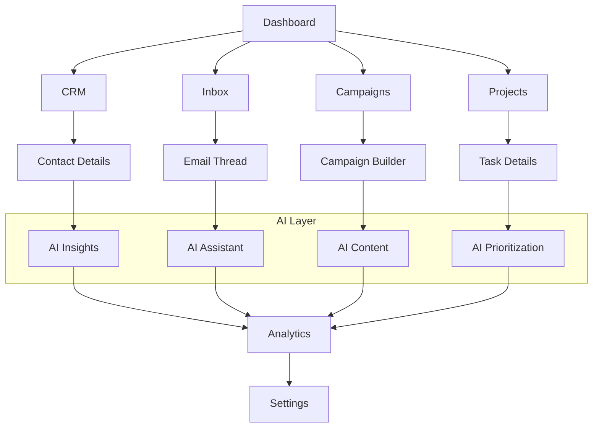

# Lima UI System - Product Requirements Document

## 1. Product Overview

Lima's UI system redesign focuses on creating a modern, minimal, and intuitive interface for the AI-powered growth operating system. The new design addresses usability issues from previous implementations while maintaining Lima's professional identity and enhancing user productivity through better information architecture and streamlined workflows.

The UI system serves B2B professionals, sales teams, and growth marketers who need efficient tools for managing relationships, campaigns, and AI-driven insights without overwhelming complexity.

## 2. Core Features

### 2.1 User Roles

| Role | Registration Method | Core Permissions |
|------|---------------------|------------------|
| Individual User | Email registration with Google OAuth | Full access to personal workspace, CRM, campaigns, and AI features |
| Team Member | Invitation-based registration | Access to shared workspaces, collaborative features, and team analytics |
| Admin User | Elevated from Team Member | User management, billing, workspace settings, and advanced configurations |

### 2.2 Feature Module

Our Lima UI system consists of the following main pages:

1. **Dashboard**: Growth pulse metrics, AI activity feed, performance charts, predictive insights panel
2. **CRM**: Company cards, contact management, relationship mapping, advanced filtering, bulk operations
3. **Inbox**: Email threads, AI assistant integration, smart filtering, compose modal, unified communications
4. **Campaigns**: Campaign builder wizard, target audience selector, template editor, performance analytics, A/B testing
5. **Projects**: Task management, project timelines, collaboration tools, progress tracking
6. **AI Assistant**: Conversational interface, prompt library, automation workflows, learning preferences
7. **Analytics**: Performance dashboards, trend analysis, ROI calculations, predictive modeling
8. **Settings**: User preferences, integrations, billing, team management, security settings

### 2.3 Page Details

| Page Name | Module Name | Feature Description |
|-----------|-------------|---------------------|
| Dashboard | Growth Pulse | Display key metrics (emails sent, replies received, meetings booked) with trend indicators and real-time updates |
| Dashboard | AI Activity Feed | Show recent AI actions, suggestions, and automated tasks with expandable details and user feedback options |
| Dashboard | Performance Charts | Visualize campaign performance, engagement trends, and conversion funnels with interactive filtering |
| Dashboard | Insights Panel | Present AI-generated insights, recommendations, and predictive analytics with actionable next steps |
| CRM | Company Cards | Display company information, recent interactions, deal status, and relationship strength with quick actions |
| CRM | Contact Management | Manage individual contacts with enriched profiles, interaction history, and AI-suggested next actions |
| CRM | Relationship Mapping | Visualize connections between contacts and companies with influence scoring and pathway analysis |
| CRM | Advanced Filtering | Filter contacts and companies by multiple criteria with saved views and smart suggestions |
| CRM | Bulk Operations | Perform actions on multiple records simultaneously with progress tracking and undo capabilities |
| Inbox | Email Threads | Display email conversations with AI-powered categorization, priority scoring, and response suggestions |
| Inbox | AI Assistant | Provide contextual email assistance, draft suggestions, and automated responses with user approval |
| Inbox | Smart Filtering | Automatically categorize emails by importance, sender type, and required actions with customizable rules |
| Inbox | Compose Modal | Create emails with AI assistance, template suggestions, and scheduling options with recipient insights |
| Campaigns | Campaign Builder | Step-by-step wizard for creating outreach campaigns with AI-powered content generation and optimization |
| Campaigns | Target Selector | Choose campaign recipients using AI-powered audience segmentation and lookalike modeling |
| Campaigns | Template Editor | Create and customize email templates with AI suggestions, A/B testing variants, and personalization tokens |
| Campaigns | Performance Analytics | Track campaign metrics, engagement rates, and conversion attribution with comparative analysis |
| Projects | Task Management | Create, assign, and track tasks with AI-powered prioritization and deadline predictions |
| Projects | Timeline View | Visualize project progress with Gantt charts, milestone tracking, and dependency management |
| Projects | Collaboration Tools | Enable team communication, file sharing, and real-time updates with notification management |
| AI Assistant | Conversational Interface | Chat-based interaction for queries, task automation, and strategic guidance with context awareness |
| AI Assistant | Prompt Library | Pre-built prompts for common tasks with customization options and performance tracking |
| AI Assistant | Automation Workflows | Create and manage automated sequences with trigger conditions and approval gates |
| Analytics | Performance Dashboard | Comprehensive view of all metrics with customizable widgets and drill-down capabilities |
| Analytics | Trend Analysis | Historical data visualization with pattern recognition and anomaly detection |
| Analytics | ROI Calculations | Calculate return on investment for campaigns and activities with attribution modeling |
| Settings | User Preferences | Customize interface, notifications, and AI behavior with granular control options |
| Settings | Integrations | Manage connections to external tools and services with authentication and sync status |
| Settings | Team Management | Add, remove, and manage team members with role-based permissions and activity monitoring |

## 3. Core Process

### Primary User Flow
Users begin at the Dashboard to review growth metrics and AI insights. They navigate to the CRM to manage relationships and identify opportunities, then use the Inbox to handle communications with AI assistance. Campaign creation flows through the dedicated builder, while ongoing work is managed in Projects. The AI Assistant provides contextual help throughout all workflows.

### AI-Enhanced Workflow
The AI system continuously learns from user interactions, suggesting optimizations and automating routine tasks. Users can approve or modify AI suggestions, with the system adapting to preferences over time. Critical decisions require user confirmation, while routine tasks can be fully automated based on user-defined rules.

### Collaboration Flow
Team members share workspaces with role-based access controls. Activities are tracked and visible to relevant team members, with notification preferences customizable per user. Admins can monitor team performance and adjust permissions as needed.

## 4. User Interface Design

### 4.1 Design Style

**Color Palette:**
- Primary: #3B82F6 (Professional Blue) with supporting shades #EFF6FF to #1E3A8A
- AI Features: #8B5CF6 (Intelligent Purple) with supporting shades #F5F3FF to #6D28D9
- Success: #10B981 (Growth Green) for positive metrics and confirmations
- Warning: #F59E0B (Attention Amber) for alerts and important notices
- Error: #EF4444 (Critical Red) for errors and destructive actions
- Neutral: #0F172A to #94A3B8 (Sophisticated Grays) for text and backgrounds

**Typography:**
- Primary Font: Inter (clean, professional, highly readable)
- Monospace Font: JetBrains Mono (for code and data)
- Scale: Display (72px-30px), Heading (24px-16px), Body (20px-12px), Label (14px-11px)
- Weight: Regular (400), Medium (500), Semibold (600), Bold (700)

**Button Styles:**
- Primary: Rounded corners (8px), subtle hover elevation, smooth transitions
- AI Features: Gradient backgrounds with purple accent
- Sizes: XS (32px), SM (36px), MD (40px), LG (44px), XL (48px)
- States: Default, hover (-2px elevation), active, disabled (50% opacity)

**Layout Principles:**
- Card-based design with subtle shadows and rounded corners
- Generous white space (16px, 24px, 32px, 48px grid)
- Sidebar navigation (320px) with collapsible sections
- Content area with maximum 1200px width for readability
- Consistent 8px spacing unit throughout interface

**Icon Style:**
- Lucide React icon library for consistency
- 16px and 20px sizes for inline use, 24px for standalone
- Consistent stroke width (1.5px) and rounded line caps
- Contextual colors matching surrounding text

### 4.2 Page Design Overview

| Page Name | Module Name | UI Elements |
|-----------|-------------|-------------|
| Dashboard | Growth Pulse | Metric cards with gradient backgrounds, trend indicators with micro-animations, real-time updating numbers |
| Dashboard | AI Activity | Timeline layout with avatar icons, expandable action cards, subtle pulse animations for new items |
| Dashboard | Performance Charts | Interactive line and bar charts with hover tooltips, time range selectors, and export options |
| Dashboard | Insights Panel | Card-based layout with AI badge, expandable details, and action buttons for implementing suggestions |
| CRM | Company Cards | Grid layout with company logos, key metrics overlay, hover effects revealing quick actions |
| CRM | Contact List | Table view with sortable columns, inline editing, batch selection checkboxes, and status indicators |
| CRM | Relationship Map | Interactive network diagram with zoom controls, node clustering, and relationship strength visualization |
| CRM | Filter Panel | Collapsible sidebar with grouped filter options, saved view dropdown, and clear all functionality |
| Inbox | Email List | Conversation threads with sender avatars, subject preview, AI priority badges, and unread indicators |
| Inbox | Email Thread | Chat-like interface with message bubbles, attachment previews, and inline reply composition |
| Inbox | AI Assistant | Floating panel with chat interface, suggestion cards, and contextual action buttons |
| Inbox | Compose Modal | Full-screen overlay with rich text editor, recipient suggestions, and AI writing assistance |
| Campaigns | Builder Wizard | Step-by-step progress indicator, form sections with validation, preview pane, and navigation controls |
| Campaigns | Target Selector | Audience cards with selection checkboxes, filter criteria builder, and estimated reach counter |
| Campaigns | Template Editor | Split-pane layout with code/preview toggle, drag-drop components, and real-time preview updates |
| Campaigns | Analytics Dashboard | KPI cards with trend arrows, conversion funnel visualization, and comparative performance charts |
| Projects | Task Board | Kanban-style columns with drag-drop functionality, task cards with assignee avatars and due dates |
| Projects | Timeline View | Gantt chart with interactive bars, dependency lines, milestone markers, and zoom controls |
| AI Assistant | Chat Interface | Message bubbles with typing indicators, quick action buttons, and conversation history search |
| AI Assistant | Prompt Library | Grid of prompt cards with categories, search functionality, and usage statistics |
| Analytics | Dashboard Grid | Customizable widget layout with drag-drop positioning, resize handles, and widget configuration panels |
| Analytics | Chart Visualizations | Interactive charts with drill-down capability, data export options, and annotation features |
| Settings | Preference Panels | Tabbed interface with form sections, toggle switches, and immediate preview of changes |
| Settings | Integration Cards | Service logos with connection status, configuration buttons, and sync activity indicators |

### 4.3 Responsiveness

The Lima UI system follows a desktop-first approach with mobile-adaptive design:

**Breakpoints:**
- Desktop: 1024px+ (primary experience)
- Tablet: 768px-1023px (adapted layouts)
- Mobile: 320px-767px (simplified interface)

**Mobile Adaptations:**
- Collapsible sidebar becomes slide-out drawer
- Card grids become single-column stacks
- Tables transform to card-based lists
- Touch-optimized button sizes (minimum 44px)
- Swipe gestures for navigation and actions
- Simplified navigation with bottom tab bar

**Touch Interactions:**
- Swipe to archive/delete emails
- Pull-to-refresh on data lists
- Long press for context menus
- Pinch-to-zoom on charts and diagrams
- Drag-and-drop with haptic feedback

## 5. Technical Requirements

### 5.1 Performance Standards
- Initial page load: <2 seconds
- Component rendering: <100ms
- API response handling: <500ms
- Smooth animations: 60fps
- Bundle size optimization: <500KB initial load

### 5.2 Accessibility Compliance
- WCAG 2.1 AA compliance
- Keyboard navigation support
- Screen reader compatibility
- Color contrast ratio >4.5:1
- Focus indicators on all interactive elements
- Alternative text for all images and icons

### 5.3 Browser Support
- Chrome 90+ (primary)
- Firefox 88+ (secondary)
- Safari 14+ (secondary)
- Edge 90+ (secondary)
- Progressive enhancement for older browsers

### 5.4 Integration Requirements
- Supabase authentication and data
- Real-time updates via WebSocket
- Email service integration (IMAP/SMTP)
- AI service API integration
- Third-party tool connections (CRM, calendar)

## 6. Success Metrics

### 6.1 User Experience Metrics
- Task completion rate: >90%
- Time to complete common tasks: <50% reduction
- User satisfaction score: >4.5/5
- Feature adoption rate: >70% within 30 days
- Support ticket reduction: >40%

### 6.2 Performance Metrics
- Page load speed: <2 seconds
- First contentful paint: <1 second
- Cumulative layout shift: <0.1
- Time to interactive: <3 seconds
- Error rate: <1%

### 6.3 Business Metrics
- User engagement increase: >25%
- Feature utilization improvement: >40%
- Customer retention improvement: >15%
- Onboarding completion rate: >85%
- Premium feature adoption: >30%

## 7. Implementation Phases

### Phase 1: Foundation (Weeks 1-2)
- Core UI component library
- Design system implementation
- Layout and navigation structure
- Basic responsive framework

### Phase 2: Dashboard & CRM (Weeks 3-4)
- Dashboard metric cards and charts
- CRM interface with filtering
- Data visualization components
- Search and filter functionality

### Phase 3: Communication (Weeks 5-6)
- Email inbox interface
- AI assistant integration
- Compose and reply functionality
- Real-time updates

### Phase 4: Campaigns & Projects (Weeks 7-8)
- Campaign builder wizard
- Project management interface
- Analytics dashboard
- Collaboration features

### Phase 5: Polish & Optimization (Weeks 9-10)
- Performance optimization
- Accessibility improvements
- Mobile responsiveness
- User testing and refinements

## 8. Risk Mitigation

### 8.1 Technical Risks
- **Component Compatibility**: Gradual migration with feature flags
- **Performance Impact**: Lazy loading and code splitting
- **Browser Compatibility**: Progressive enhancement strategy
- **Data Migration**: Backward compatibility maintenance

### 8.2 User Experience Risks
- **Learning Curve**: Guided onboarding and tooltips
- **Feature Discoverability**: Progressive disclosure and help system
- **Workflow Disruption**: Parallel deployment with user choice
- **Accessibility Issues**: Comprehensive testing and validation

### 8.3 Business Risks
- **Development Timeline**: Phased rollout with MVP approach
- **Resource Allocation**: Cross-functional team coordination
- **User Adoption**: Change management and training programs
- **Competitive Pressure**: Focus on unique AI-powered features

This comprehensive UI system redesign positions Lima as a modern, intuitive platform that enhances user productivity while maintaining the sophisticated functionality required for B2B growth operations.