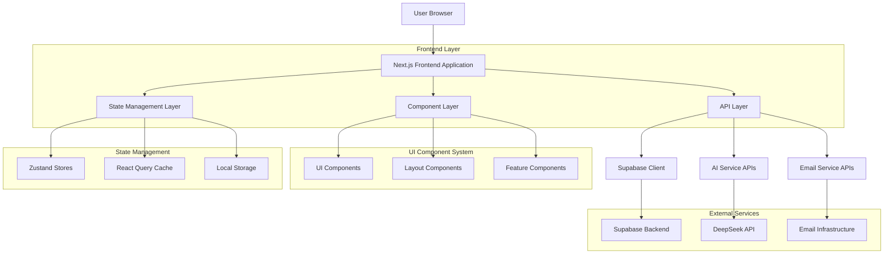
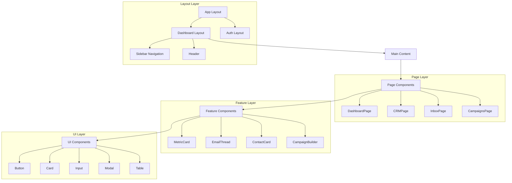
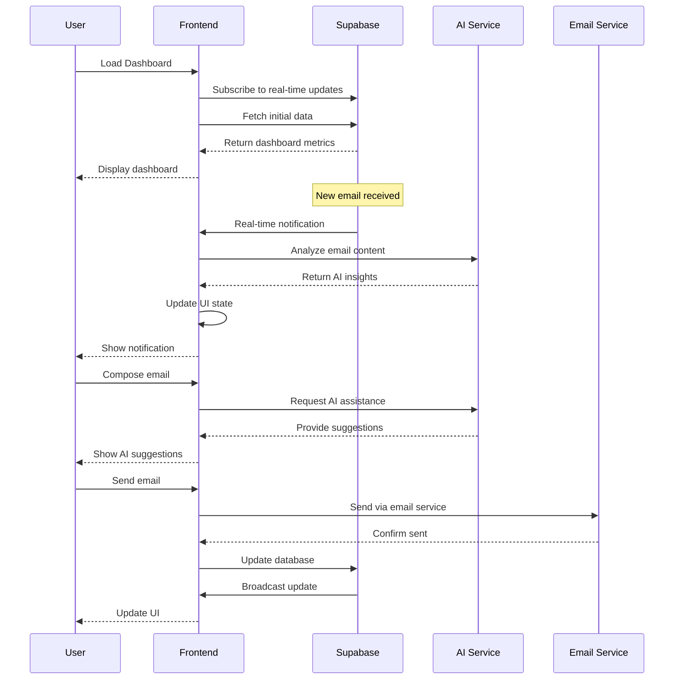
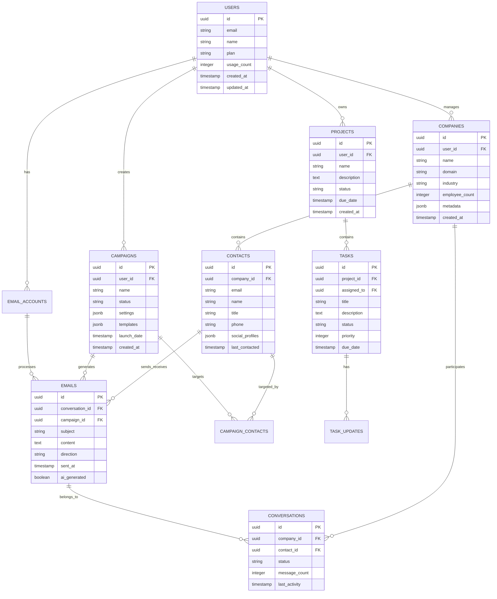

# Lima UI System - Technical Architecture Document

## 1. Architecture Design



## 2. Technology Description

- **Frontend**: Next.js 15 + React 19 + TypeScript + Tailwind CSS 4
- **UI Components**: Radix UI + Headless UI + Custom Component Library
- **State Management**: Zustand + React Query + React Hook Form
- **Styling**: Tailwind CSS + CSS Modules + Framer Motion
- **Icons**: Lucide React + Custom SVG Icons
- **Charts**: Recharts + D3.js (for complex visualizations)
- **Backend**: Supabase (PostgreSQL + Auth + Real-time + Storage)
- **AI Integration**: DeepSeek API + Custom AI Middleware
- **Email**: IMAP/SMTP Integration + Nodemailer
- **Development**: Storybook + Jest + Playwright + ESLint + Prettier

## 3. Route Definitions

| Route | Purpose |
|-------|----------|
| `/` | Landing page with authentication redirect |
| `/auth/signin` | User authentication and login |
| `/auth/signup` | User registration and onboarding |
| `/dashboard` | Main dashboard with growth metrics and AI insights |
| `/crm` | Customer relationship management interface |
| `/crm/companies` | Company management and details |
| `/crm/contacts` | Contact management and profiles |
| `/inbox` | Email inbox with AI-powered features |
| `/inbox/[threadId]` | Individual email thread view |
| `/campaigns` | Campaign management and builder |
| `/campaigns/create` | Campaign creation wizard |
| `/campaigns/[id]` | Campaign details and analytics |
| `/projects` | Project management and collaboration |
| `/projects/[id]` | Individual project workspace |
| `/ai` | AI assistant and automation center |
| `/analytics` | Advanced analytics and reporting |
| `/settings` | User preferences and configuration |
| `/settings/team` | Team management and permissions |
| `/settings/integrations` | Third-party service connections |

## 4. API Definitions

### 4.1 Authentication APIs

**User Authentication**
```
POST /auth/v1/token
```

Request:
| Param Name | Param Type | isRequired | Description |
|------------|------------|------------|-------------|
| email | string | true | User email address |
| password | string | true | User password |
| provider | string | false | OAuth provider (google, microsoft) |

Response:
| Param Name | Param Type | Description |
|------------|------------|-------------|
| access_token | string | JWT access token |
| refresh_token | string | Token for refreshing access |
| user | object | User profile information |
| expires_in | number | Token expiration time |

Example:
```json
{
  "email": "user@company.com",
  "password": "securePassword123"
}
```

### 4.2 Dashboard APIs

**Growth Metrics**
```
GET /api/dashboard/metrics
```

Response:
| Param Name | Param Type | Description |
|------------|------------|-------------|
| growth_pulse | object | Key growth metrics and trends |
| campaign_performance | object | Campaign statistics and rates |
| ai_activity | array | Recent AI actions and suggestions |
| insights | array | AI-generated insights and recommendations |

Example Response:
```json
{
  "growth_pulse": {
    "emails_sent": 1247,
    "replies_received": 89,
    "meetings_booked": 23,
    "escalations": 5
  },
  "campaign_performance": {
    "open_rate": 0.34,
    "reply_rate": 0.12,
    "conversion_rate": 0.08
  }
}
```

### 4.3 CRM APIs

**Company Management**
```
GET /api/crm/companies
POST /api/crm/companies
PUT /api/crm/companies/{id}
DELETE /api/crm/companies/{id}
```

**Contact Management**
```
GET /api/crm/contacts
POST /api/crm/contacts
PUT /api/crm/contacts/{id}
DELETE /api/crm/contacts/{id}
```

### 4.4 Email APIs

**Email Operations**
```
GET /api/email/threads
GET /api/email/threads/{id}
POST /api/email/send
PUT /api/email/threads/{id}/reply
```

**AI Email Assistance**
```
POST /api/ai/email/suggest
POST /api/ai/email/draft
POST /api/ai/email/analyze
```

### 4.5 Campaign APIs

**Campaign Management**
```
GET /api/campaigns
POST /api/campaigns
PUT /api/campaigns/{id}
DELETE /api/campaigns/{id}
POST /api/campaigns/{id}/launch
```

**Campaign Analytics**
```
GET /api/campaigns/{id}/analytics
GET /api/campaigns/{id}/performance
```

## 5. Component Architecture



## 6. State Management Architecture

### 6.1 Zustand Store Structure

```typescript
// Global State Stores
interface AuthStore {
  user: User | null;
  session: Session | null;
  signIn: (email: string, password: string) => Promise<void>;
  signOut: () => Promise<void>;
  updateProfile: (data: Partial<User>) => Promise<void>;
}

interface UIStore {
  sidebarOpen: boolean;
  theme: 'light' | 'dark';
  notifications: Notification[];
  toggleSidebar: () => void;
  setTheme: (theme: 'light' | 'dark') => void;
  addNotification: (notification: Notification) => void;
  removeNotification: (id: string) => void;
}

interface DashboardStore {
  metrics: GrowthMetrics | null;
  insights: AIInsight[];
  loading: boolean;
  error: string | null;
  fetchMetrics: () => Promise<void>;
  refreshInsights: () => Promise<void>;
}

interface CRMStore {
  companies: Company[];
  contacts: Contact[];
  selectedCompany: Company | null;
  selectedContact: Contact | null;
  filters: CRMFilters;
  searchQuery: string;
  setFilters: (filters: CRMFilters) => void;
  setSearchQuery: (query: string) => void;
  selectCompany: (company: Company) => void;
  selectContact: (contact: Contact) => void;
}

interface EmailStore {
  threads: EmailThread[];
  selectedThread: EmailThread | null;
  composeOpen: boolean;
  aiSuggestions: AISuggestion[];
  filters: EmailFilters;
  selectThread: (thread: EmailThread) => void;
  toggleCompose: () => void;
  sendEmail: (data: EmailData) => Promise<void>;
  fetchAISuggestions: (context: string) => Promise<void>;
}

interface CampaignStore {
  campaigns: Campaign[];
  selectedCampaign: Campaign | null;
  builderStep: number;
  builderData: CampaignBuilderData;
  analytics: CampaignAnalytics | null;
  createCampaign: (data: CampaignData) => Promise<void>;
  updateBuilderData: (data: Partial<CampaignBuilderData>) => void;
  nextStep: () => void;
  previousStep: () => void;
}
```

### 6.2 React Query Integration

```typescript
// Query Keys
export const queryKeys = {
  dashboard: {
    metrics: ['dashboard', 'metrics'] as const,
    insights: ['dashboard', 'insights'] as const,
  },
  crm: {
    companies: (filters?: CRMFilters) => ['crm', 'companies', filters] as const,
    contacts: (filters?: CRMFilters) => ['crm', 'contacts', filters] as const,
    company: (id: string) => ['crm', 'company', id] as const,
  },
  email: {
    threads: (filters?: EmailFilters) => ['email', 'threads', filters] as const,
    thread: (id: string) => ['email', 'thread', id] as const,
  },
  campaigns: {
    list: ['campaigns'] as const,
    campaign: (id: string) => ['campaigns', id] as const,
    analytics: (id: string) => ['campaigns', id, 'analytics'] as const,
  },
} as const;

// Custom Hooks
export function useDashboardMetrics() {
  return useQuery({
    queryKey: queryKeys.dashboard.metrics,
    queryFn: () => dashboardApi.getMetrics(),
    staleTime: 5 * 60 * 1000, // 5 minutes
    refetchInterval: 30 * 1000, // 30 seconds
  });
}

export function useCompanies(filters?: CRMFilters) {
  return useQuery({
    queryKey: queryKeys.crm.companies(filters),
    queryFn: () => crmApi.getCompanies(filters),
    keepPreviousData: true,
  });
}

export function useCreateCampaign() {
  const queryClient = useQueryClient();
  
  return useMutation({
    mutationFn: campaignApi.create,
    onSuccess: () => {
      queryClient.invalidateQueries({ queryKey: queryKeys.campaigns.list });
    },
  });
}
```

## 7. Real-time Data Flow



## 8. Performance Optimization

### 8.1 Code Splitting Strategy

```typescript
// Route-based code splitting
const DashboardPage = lazy(() => import('@/pages/dashboard'));
const CRMPage = lazy(() => import('@/pages/crm'));
const InboxPage = lazy(() => import('@/pages/inbox'));
const CampaignsPage = lazy(() => import('@/pages/campaigns'));

// Component-based code splitting
const CampaignBuilder = lazy(() => import('@/components/campaigns/campaign-builder'));
const AnalyticsChart = lazy(() => import('@/components/analytics/chart'));

// Feature-based code splitting
const AIAssistant = lazy(() => import('@/features/ai-assistant'));
```

### 8.2 Caching Strategy

```typescript
// React Query cache configuration
const queryClient = new QueryClient({
  defaultOptions: {
    queries: {
      staleTime: 5 * 60 * 1000, // 5 minutes
      cacheTime: 10 * 60 * 1000, // 10 minutes
      retry: (failureCount, error) => {
        if (error.status === 404) return false;
        return failureCount < 3;
      },
    },
  },
});

// Service Worker for offline caching
if ('serviceWorker' in navigator) {
  navigator.serviceWorker.register('/sw.js');
}
```

### 8.3 Bundle Optimization

```javascript
// Next.js configuration
module.exports = {
  experimental: {
    optimizeCss: true,
    optimizePackageImports: ['lucide-react', '@radix-ui/react-icons'],
  },
  compiler: {
    removeConsole: process.env.NODE_ENV === 'production',
  },
  webpack: (config) => {
    config.optimization.splitChunks = {
      chunks: 'all',
      cacheGroups: {
        vendor: {
          test: /[\\/]node_modules[\\/]/,
          name: 'vendors',
          chunks: 'all',
        },
        ui: {
          test: /[\\/]components[\\/]ui[\\/]/,
          name: 'ui',
          chunks: 'all',
        },
      },
    };
    return config;
  },
};
```

## 9. Data Model

### 9.1 Data Model Definition



### 9.2 Data Definition Language

```sql
-- Enhanced Users Table
CREATE TABLE users (
    id UUID PRIMARY KEY DEFAULT gen_random_uuid(),
    email VARCHAR(255) UNIQUE NOT NULL,
    name VARCHAR(100) NOT NULL,
    avatar_url TEXT,
    plan VARCHAR(20) DEFAULT 'free' CHECK (plan IN ('free', 'pro', 'enterprise')),
    usage_count INTEGER DEFAULT 0,
    preferences JSONB DEFAULT '{}',
    created_at TIMESTAMP WITH TIME ZONE DEFAULT NOW(),
    updated_at TIMESTAMP WITH TIME ZONE DEFAULT NOW()
);

-- UI Preferences Table
CREATE TABLE user_preferences (
    id UUID PRIMARY KEY DEFAULT gen_random_uuid(),
    user_id UUID REFERENCES users(id) ON DELETE CASCADE,
    theme VARCHAR(10) DEFAULT 'light' CHECK (theme IN ('light', 'dark')),
    sidebar_collapsed BOOLEAN DEFAULT false,
    notifications_enabled BOOLEAN DEFAULT true,
    ai_assistance_level VARCHAR(20) DEFAULT 'medium' CHECK (ai_assistance_level IN ('minimal', 'medium', 'maximum')),
    dashboard_layout JSONB DEFAULT '{}',
    created_at TIMESTAMP WITH TIME ZONE DEFAULT NOW(),
    updated_at TIMESTAMP WITH TIME ZONE DEFAULT NOW()
);

-- Enhanced Companies Table
CREATE TABLE companies (
    id UUID PRIMARY KEY DEFAULT gen_random_uuid(),
    user_id UUID REFERENCES users(id) ON DELETE CASCADE,
    name VARCHAR(255) NOT NULL,
    domain VARCHAR(255),
    industry VARCHAR(100),
    employee_count INTEGER,
    annual_revenue BIGINT,
    location VARCHAR(255),
    logo_url TEXT,
    description TEXT,
    metadata JSONB DEFAULT '{}',
    relationship_strength INTEGER DEFAULT 0 CHECK (relationship_strength BETWEEN 0 AND 100),
    last_interaction TIMESTAMP WITH TIME ZONE,
    created_at TIMESTAMP WITH TIME ZONE DEFAULT NOW(),
    updated_at TIMESTAMP WITH TIME ZONE DEFAULT NOW()
);

-- Enhanced Contacts Table
CREATE TABLE contacts (
    id UUID PRIMARY KEY DEFAULT gen_random_uuid(),
    company_id UUID REFERENCES companies(id) ON DELETE CASCADE,
    email VARCHAR(255) NOT NULL,
    name VARCHAR(255) NOT NULL,
    title VARCHAR(255),
    phone VARCHAR(50),
    linkedin_url TEXT,
    twitter_handle VARCHAR(100),
    avatar_url TEXT,
    bio TEXT,
    interests TEXT[],
    engagement_score INTEGER DEFAULT 0 CHECK (engagement_score BETWEEN 0 AND 100),
    last_contacted TIMESTAMP WITH TIME ZONE,
    response_rate DECIMAL(3,2) DEFAULT 0.00,
    created_at TIMESTAMP WITH TIME ZONE DEFAULT NOW(),
    updated_at TIMESTAMP WITH TIME ZONE DEFAULT NOW()
);

-- UI State Table for Dashboard Customization
CREATE TABLE dashboard_widgets (
    id UUID PRIMARY KEY DEFAULT gen_random_uuid(),
    user_id UUID REFERENCES users(id) ON DELETE CASCADE,
    widget_type VARCHAR(50) NOT NULL,
    position_x INTEGER NOT NULL,
    position_y INTEGER NOT NULL,
    width INTEGER NOT NULL,
    height INTEGER NOT NULL,
    configuration JSONB DEFAULT '{}',
    is_visible BOOLEAN DEFAULT true,
    created_at TIMESTAMP WITH TIME ZONE DEFAULT NOW(),
    updated_at TIMESTAMP WITH TIME ZONE DEFAULT NOW()
);

-- Notification System
CREATE TABLE notifications (
    id UUID PRIMARY KEY DEFAULT gen_random_uuid(),
    user_id UUID REFERENCES users(id) ON DELETE CASCADE,
    type VARCHAR(50) NOT NULL,
    title VARCHAR(255) NOT NULL,
    message TEXT NOT NULL,
    action_url TEXT,
    is_read BOOLEAN DEFAULT false,
    priority VARCHAR(20) DEFAULT 'medium' CHECK (priority IN ('low', 'medium', 'high', 'urgent')),
    created_at TIMESTAMP WITH TIME ZONE DEFAULT NOW()
);

-- Create indexes for performance
CREATE INDEX idx_companies_user_id ON companies(user_id);
CREATE INDEX idx_companies_domain ON companies(domain);
CREATE INDEX idx_contacts_company_id ON contacts(company_id);
CREATE INDEX idx_contacts_email ON contacts(email);
CREATE INDEX idx_contacts_engagement_score ON contacts(engagement_score DESC);
CREATE INDEX idx_dashboard_widgets_user_id ON dashboard_widgets(user_id);
CREATE INDEX idx_notifications_user_id_unread ON notifications(user_id, is_read) WHERE is_read = false;

-- Row Level Security (RLS) policies
ALTER TABLE users ENABLE ROW LEVEL SECURITY;
ALTER TABLE user_preferences ENABLE ROW LEVEL SECURITY;
ALTER TABLE companies ENABLE ROW LEVEL SECURITY;
ALTER TABLE contacts ENABLE ROW LEVEL SECURITY;
ALTER TABLE dashboard_widgets ENABLE ROW LEVEL SECURITY;
ALTER TABLE notifications ENABLE ROW LEVEL SECURITY;

-- RLS Policies
CREATE POLICY "Users can view own profile" ON users FOR SELECT USING (auth.uid() = id);
CREATE POLICY "Users can update own profile" ON users FOR UPDATE USING (auth.uid() = id);

CREATE POLICY "Users can manage own preferences" ON user_preferences FOR ALL USING (auth.uid() = user_id);
CREATE POLICY "Users can manage own companies" ON companies FOR ALL USING (auth.uid() = user_id);
CREATE POLICY "Users can manage contacts of own companies" ON contacts FOR ALL USING (
    EXISTS (SELECT 1 FROM companies WHERE companies.id = contacts.company_id AND companies.user_id = auth.uid())
);
CREATE POLICY "Users can manage own dashboard widgets" ON dashboard_widgets FOR ALL USING (auth.uid() = user_id);
CREATE POLICY "Users can manage own notifications" ON notifications FOR ALL USING (auth.uid() = user_id);

-- Grant permissions
GRANT SELECT ON users TO anon;
GRANT ALL PRIVILEGES ON users TO authenticated;
GRANT ALL PRIVILEGES ON user_preferences TO authenticated;
GRANT ALL PRIVILEGES ON companies TO authenticated;
GRANT ALL PRIVILEGES ON contacts TO authenticated;
GRANT ALL PRIVILEGES ON dashboard_widgets TO authenticated;
GRANT ALL PRIVILEGES ON notifications TO authenticated;

-- Initial data for development
INSERT INTO users (email, name, plan) VALUES 
('demo@lima.ai', 'Demo User', 'pro'),
('admin@lima.ai', 'Admin User', 'enterprise');

INSERT INTO companies (user_id, name, domain, industry, employee_count) VALUES 
((SELECT id FROM users WHERE email = 'demo@lima.ai'), 'Acme Corp', 'acme.com', 'Technology', 500),
((SELECT id FROM users WHERE email = 'demo@lima.ai'), 'Beta Industries', 'beta.com', 'Manufacturing', 1200);
```

This technical architecture provides a comprehensive foundation for implementing Lima's modern UI system with scalable, maintainable, and performant code structure.